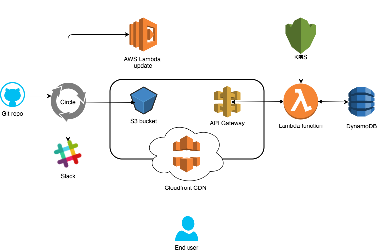

# Serverless Application Template

A template project for creating new Serverless applications leveraging AWS services.

## Before starting

### Prerequisites
You need these installed on your machine before you can begin.

* Docker
* Docker Compose
* CMake

You will also need an _AWS Account_

### Technology Used
* Docker, Docker Compose
* Terraform
* AWS Lambda, API Gateway, DynamoDB, S3, CloudFront
* React.js, Redux, Sass, Webpack
* Circle CI

### Architecture
Overview of how the application fits together.



## Getting setup

### Building the app

You can build the app locally by running `make build`. Make sure to run `make init` on first-time setup, as this will install all required node package dependencies for both the client and the lambdas.

### Running it locally

To run the whole stack locally, including the local API mock and DynamoDB instance, run the `docker-compose up` command. This will run a webpack dev server for the client application, a simple express application for the API and a DynamoDB instance.

### Running terraform

#### Initial setup on the AWS Console

Before you can provision your infrastructure, there are (unfortunately) some manual tasks to perform on the AWS Console.

* Create an account on [AWS](https://aws.amazon.com/console/)
* You will need to create a new S3 bucket before you can start. It will need to be named in the following format: `[YOUR_APP_NAME]-terraform-state`
    * This is used to store the current state of our resources provisioned with Terraform.
* Edit the `infrastructure/variables.tf` file so the `app_name` variable in Terraform is set to the same name.
* Edit the `infrastructure/main.tf` file and rename the s3 backend bucket name to the name of the bucket you created in the AWS Console. The config should look something like this:

```
terraform {
  backend "s3" {
    bucket = "[YOUR_APP_NAME]-terraform-state"
    key = "[YOUR_APP_NAME]"
    region = "eu-west-2"
    shared_credentials_file = "/infrastructure/aws.credentials"
  }
}

provider "aws" {
  shared_credentials_file = "/infrastructure/aws.credentials"
  profile = "default"
  region = "${var.region}"
}

```

* Edit the default value for `app_name` in the Makefile to the same name, this is so Circle CI knows which S3 Buckets to use.
* Create the `infrastructure/aws.credentials` file with the following format:

```
[default]
aws_access_key_id = [YOUR_AWS_ACCESS_KEY_ID_HERE]
aws_secret_access_key = [YOUR_AWS_SECRET_ACCESS_KEY_HERE]
```

* You can get your credentials by downloading them from IAM in the AWS console
* You are now ready to run terraform

#### Terraform commands

Possible values for [ENV]:
```
dev, uat, prod
```

* `make terraform-init env=[ENV]`
  * You will need to run this first (and only once per environment) to initialise the state per environment.
* `make terraform-validate env=[ENV]`
  * Validates that your terraform files are syntactically correct according to the HCL spec.
* `make terraform-plan env=[ENV]`
  * Run this first before you want to apply any changes to your AWS infrastructure. It will perform a dry-run on the changes you're about to make (kinda like doing a git diff).
* `make terraform-apply env=[ENV]`
  * This is where the magic happens! Terraform will provision your new (or delete your old) resources on AWS. Exciting.
* `make terraform-destroy env=[ENV]`
  * Careful with this one. It will remove all resources for an environment on AWS.

## Information

* [Makefile](info/makefile.md)
* [The Docker Compose File](info/docker_compose.md)
* [Terraform](info/terraform.md)
* Scripts
  * [Generate Certificates](info/scripts/generate_cert.md)
  * [Publish Lambdas](info/scripts/publish_lambdas.md)
  * [Terraform Init](info/scripts/terraform_init.md)
  * [Terraform Validate](info/scripts/terraform_validate.md)
  * [Terraform Plan](info/scripts/terraform_plan.md)
  * [Terraform Apply](info/scripts/terraform_apply.md)
  * [Terraform Destroy](info/scripts/terraform_destroy.md)
